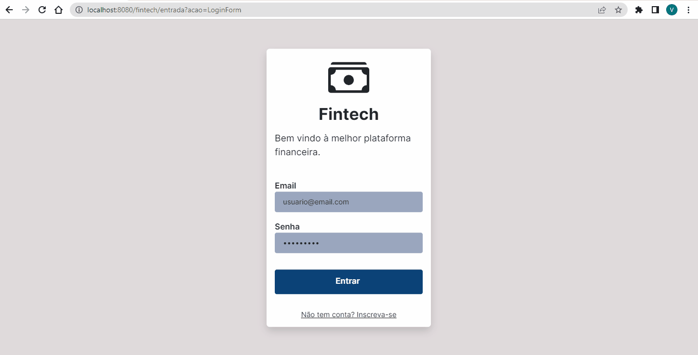

<h1 align="center">Fintech Java Web Application</h1>

Implementação de uma aplicação web em Java para o curso de Análise e Desenvolvimento de Sistemas da FIAP.

## Interface

---

## 🛠️ Tecnologias/ Ferramentas
Este projeto foi desenvolvido em Java com as seguintes tecnologias/padrões:
- HttpServlet API com Apache Tomcat;
- Persistência de Dados em um Banco de Dados Oracle;
- Password hashing e salting;
- Camada Controller implementada usando um Command Pattern
- Front-end implementado com Bootstrap.

---

## 📃 Projeto

- Aplicação web em Java para planejamento financeiro. Projeto de conclusão do primeiro ano do curso de Análise e Desenvolvimento de Sistemas da FIAP;
- Cadastro e validação de usuário, com criptografia e salting de senha;
- Cadastro de gastos e receitas do usuário;
- Cadastro de investimentos do usuário;
- Dashboard simples mostrando resumo de gastos, receitas e investimentos.

